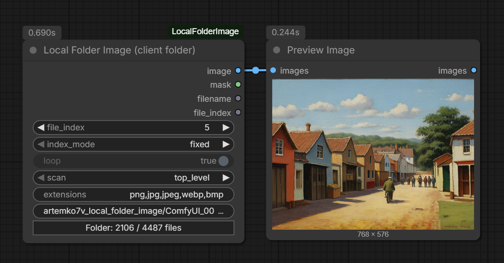
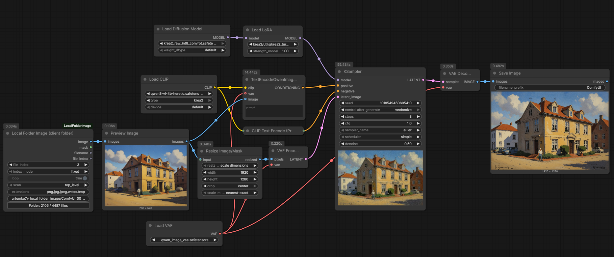
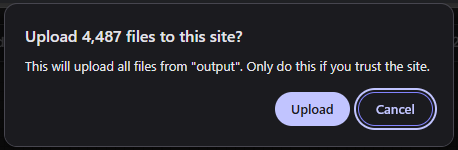

# Local Folder Image (client folder)

A ComfyUI custom node that lets the user pick a folder on **their own** machine and, on every workflow run, uploads exactly **one** file from it to the server.

Basic workflow:


## Background

Not long ago, I found that I had collected many old images generated with older models such as SD 1.5 and SDXL.

Most of these images were low quality, had many defects, and were saved at a low resolution. I wanted to use a modern model to improve them and increase their resolution. To build a kind of automatic fix-and-upscale process.

However, I did not want to upload this huge number of files to the server. So I started thinking: why not create a node that uses a local folder as the file source and uploads only one new file to the server every time the workflow starts?

This would allow me to process all the files automatically using the **Run Instant** mode.

At first, I was not sure whether this was even possible. However, with the help of Claude, a solution was found that did exactly what I needed: it went through the files in a local folder one by one, without uploading all of them to the server.

It is not perfect, but it handled my task very well.

The workflow I used to upscale the images with Krea 2:


I know that using the QwenImageEdit text encoder with Krea 2 is not completely correct, but it still works.


## Installation

```
ComfyUI/custom_nodes/ComfyUI-LocalFolderImage/
├── __init__.py
├── nodes.py
└── js/
    └── local_folder_image.js
```

Restart ComfyUI, then hard-reload the page (Ctrl+Shift+R) -- the frontend caches extensions aggressively.

## Usage

1. Add **Local Folder Image (client folder)** (category `image/loaders`).
2. Click **Pick folder...** and choose a directory. Chrome will ask something like "Upload 1000 files to this site?" -- that is expected, nothing is actually transferred at this point.
3. Queue Prompt. The folder selection persists for as many runs as you like.
4. After a **page reload** the folder has to be picked again (one click; the dialog reopens at the last used directory).

Ignore this warning:

Your files won't be uploaded anywhere, this is a default browser confirmation for the folder select dialog.

## Parameters

| Parameter | Meaning |
|---|---|
| `file_index` | 1-based position of the file to load, within the sorted and filtered list. Upper bound is tightened to the real file count once a folder is picked. |
| `index_mode` | What happens to `file_index` **after** the run: `fixed`, `increment`, `decrement`, `random`. |
| `loop` | Whether to wrap around at the ends of the list. Forced on and greyed out for `fixed` and `random`. |
| `scan` | `top_level` -- only the root of the picked folder; `recursive` -- include subfolders. |
| `extensions` | Comma-separated extension filter. |
| `filename` | Filled in automatically; shows the file that was actually uploaded. |

`index_mode`, `loop`, `scan` and `extensions` are read by the frontend; the backend ignores them and only consumes `filename`.

### Index semantics

`file_index` behaves like a seed with `control_after_generate`: the value shown on the node is the one used by the **current** run, and it is updated afterwards for the next one.

| Situation | Result |
|---|---|
| `file_index` < 1 or > file count | Error. The run is never queued. |
| `fixed` | The index never changes. |
| `random` | Next index is uniform over 1..count. Repeats are possible. |
| `increment`, index < count | Next index is index + 1. |
| `increment`, index == count, `loop` on | Next index is 1. |
| `increment`, index == count, `loop` off | Current run still executes; the **next** queue attempt fails with "all N files have been iterated". |
| `decrement`, index > 1 | Next index is index - 1. |
| `decrement`, index == 1, `loop` on | Next index is the file count. |
| `decrement`, index == 1, `loop` off | Same as above: the next queue attempt fails. |

Once exhausted, the button label shows `- exhausted`. Editing `file_index`, toggling `loop`, changing `index_mode` or picking a folder again clears that state.

With a batch count above 1 the frontend builds each queued item separately, so a batch of 4 in `increment` mode consumes four consecutive files.

## Outputs

`IMAGE`, `MASK` (from the alpha channel, empty when there is none), `filename` (STRING) and `file_index` (INT, the index actually used).

## How it works

```
Queue Prompt
  └─ patched app.graphToPrompt()
       ├─ filter and sort the stored File references
       ├─ validate file_index against the file count
       ├─ POST /upload/image  (type=temp, subfolder=artemko7v_local_folder_image)
       ├─ write the uploaded path into the filename widget
       └─ advance file_index per index_mode / loop
  └─ normal prompt serialisation -> server
       └─ Python node reads the file from the temp directory
```

`<input type="file" webkitdirectory>` yields an array of `File` objects, which
are lazy handles to data on disk rather than the bytes themselves. A thousand of
them cost roughly a megabyte. Only the selected file is ever read, and `fetch`
streams it off disk, so the tab's peak memory does not scale with folder size.

Files are sorted with a natural, locale-aware comparison, so `img2` precedes
`img10`. `input.files` has no guaranteed order, and a stable order is what makes
`file_index` meaningful across runs.

## Limitations

- **The workflow must be queued from the browser.** Queueing over the API or
  from a script means nobody uploads a file, and the node fails with
  `FileNotFoundError`.
- **The folder selection does not survive a page reload.** This is the intended
  behaviour. 
- **The folder selection is not saved in the workflow JSON.** That is a property
  of the model, not a bug.
- `webkitdirectory` is always recursive. `top_level` filters the results in the
  frontend, but the browser's confirmation dialog will still count subfolders.
- A `File` is a snapshot taken at pick time. If the file has since been deleted
  or rewritten, the run fails with the offending index named. No silent
  substitution: that would break the index contract.
- Uploads land in `temp`, not `input`, so ComfyUI clears them on restart.

## Troubleshooting

- No button on the node -> the extension did not load. Check that
  `WEB_DIRECTORY` points at `./js` and hard-reload.
- "no folder selected" on queue -> the folder was picked before a page reload.
- To confirm a file arrived, look in `ComfyUI/temp/artemko7v_local_folder_image/`.
